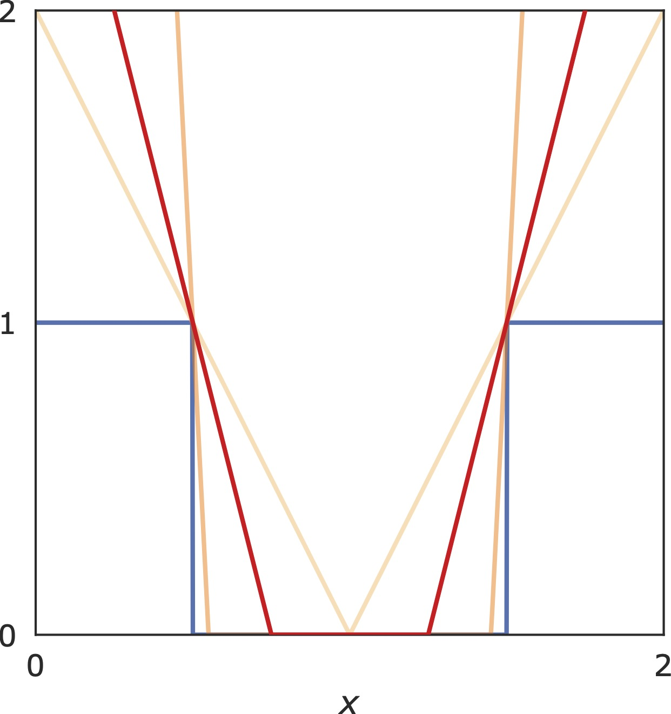
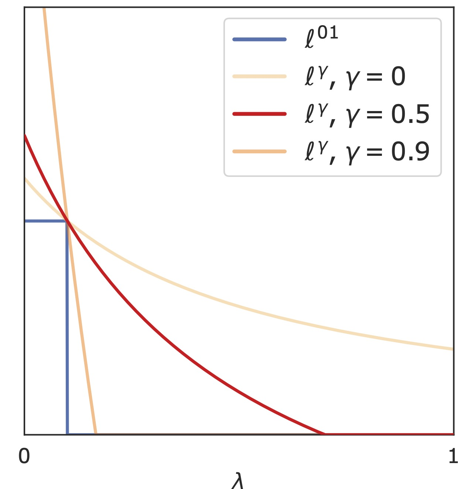
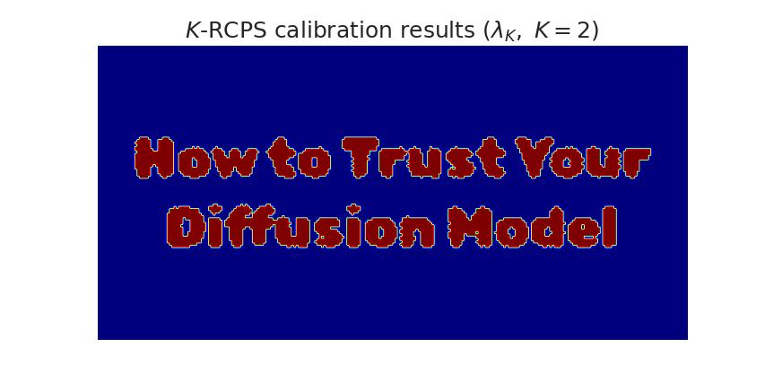

# How to Trust Your Diffusion Model:<br /> A Convex Optimization Approach to Conformal Risk Control

This is the official implementation of the paper [*How To Trust Your Diffusion Model: A Convex Optimization Approach to Conformal Risk Control*](https://arxiv.org/abs/2302.03791)

by [Jacopo Teneggi](https://jacopoteneggi.github.io), Matt Tivnan, J Webster Stayman, and [Jeremias Sulam](https://sites.google.com/view/jsulam).

---

$K$-RCPS is a high-dimensional extension of the [Risk Controlling Prediction Sets (RCPS)](https://github.com/aangelopoulos/rcps) procedure that provably minimizes the mean interval length.

It is based on $\ell^{\gamma}$: a convex upper-bound to the $01$ loss $\ell^{01}$

<div style="display:flex;justify-content:center">
     <div style="background-color:white;padding:5px">
          
     </div>
     <div style="background-color:white;padding:5px">
          
     </div>
</div>

## Demo

The demo is included in the `demo.ipynb` notebook. It showcases how to use the $K$-RCPS calibration procedure on dummy data.

<div style="display:flex;justify-content:center">
     <div>
          
     </div>
     <div>
          
     </div>
</div>

which reduces the mean interval length compared to RCPS on the same data by $\approx 9\%$.

## Usage

## How to Extend the Current Implementation

## References
```
@article{teneggi2023trust,
  title={How to Trust Your Diffusion Model: A Convex Optimization Approach to Conformal Risk Control},
  author={Teneggi, Jacopo and Tivnan, Matt and Stayman, J Webster and Sulam, Jeremias},
  journal={arXiv preprint arXiv:2302.03791},
  year={2023}
}
```